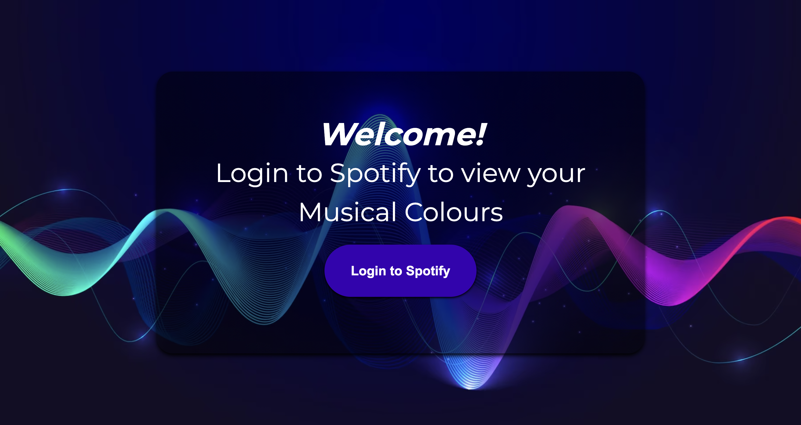
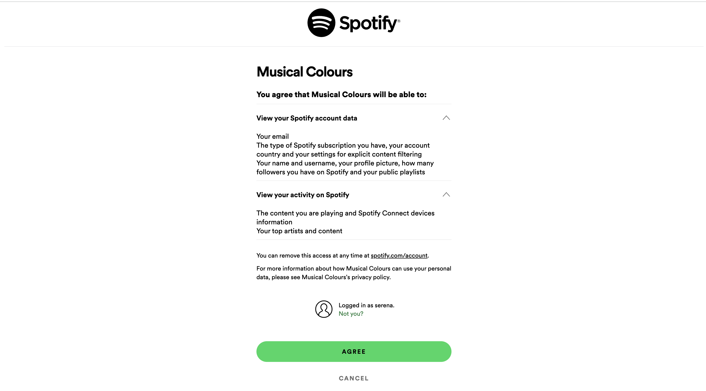
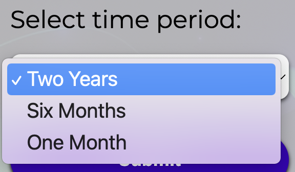
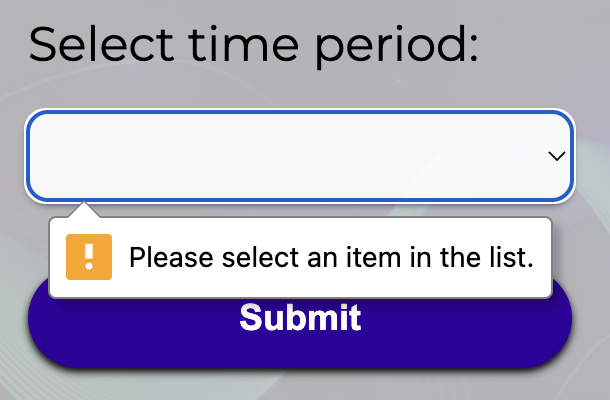
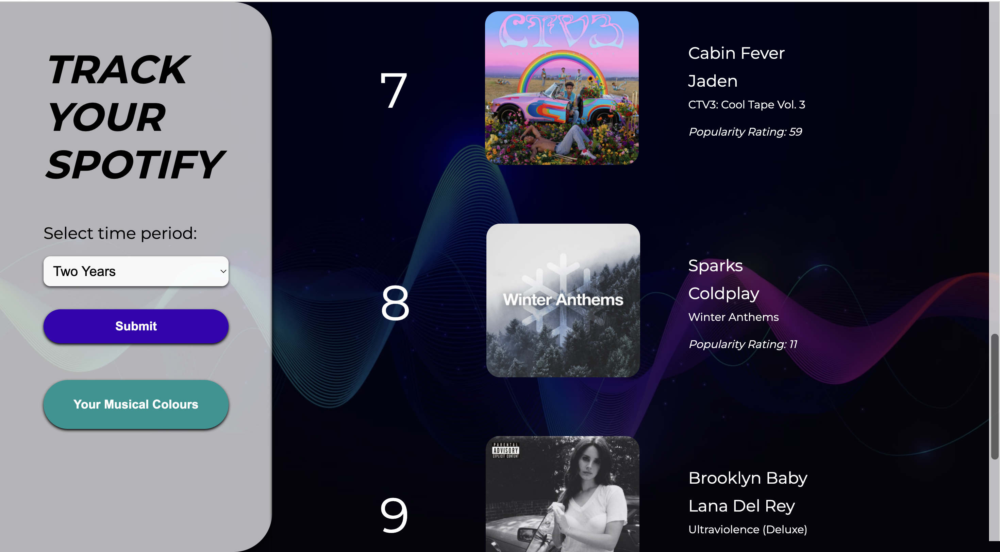
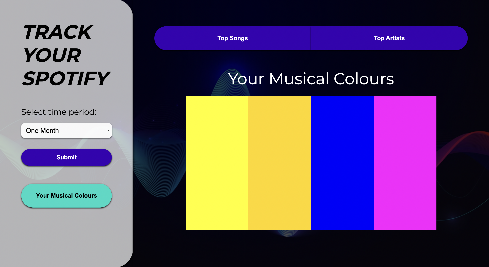
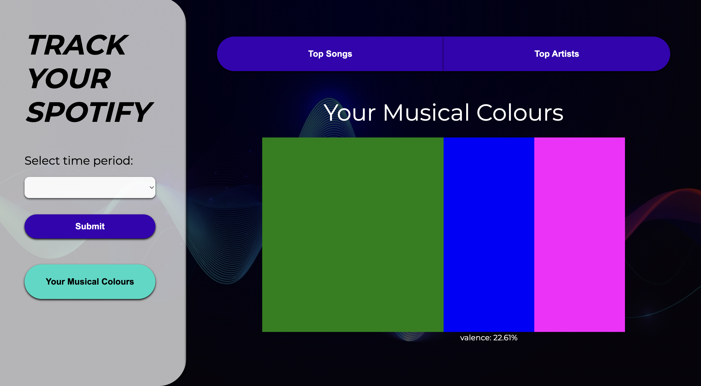

# Spotify Music Tracker 🎵
Includes code from README template by [https://github.com/scottydocs/README-template.md](https://github.com/scottydocs/README-template.md)

`Spotify Music Tracker` is a tracking `utility` providing a specialized and tailored experience for `Spotify users` to track their `music consumption` in different increments of time. Users can gain insights into their media consumption habits and patterns, allowing them to track how their preferred types of music has developed or changed overtime. By analyzing the features found in their top 10 Trakcs history, the utility assigns a unique `"Musical Colour Palette"` to each user. This palette is an abstract visual summary of the features which dominate their top 10 tracks.

## Application Configuration

There are 4 files/folders in the public folder:

1. [index.html](public/index.html): A single page architecture with dynamic views to visualise data
2. [style.css](public/style.css): A CSS stylesheet that controls the styling of the whole webpage
3. [script.js](public/script.js): A javascript file that responds to user inputs by storing and visualising the data
4. [docmentationImg](public/documentationImg): A folder containing PNG files used in this README.md

## Prerequisites

Before you begin, ensure you have met the following requirements:
* You have installed the latest version of `Node.js`.
* You have a `Windows`, `Linux`, or `Mac` machine. (This project is supported on all major operating systems.)
* You have read the documentation related to the project, which can be found at `<insert_link_to_documentation>`.

## Deployment Procedures

Please follow the below steps to deploy the website:

1. Use `index.html` as the entry point of the website.
2. The website is designed to provide the best experience on screens with a `1020px x 948px` aspect ratio. However, it is also optimized for other window sizes classed: [compact, medium, and expanded](https://material.io/blog/material-you-large-screens), including **tablet**`(600px < 840px)` and **mobile** `600px`. Please note that some functions may be limited on mobile devices, such as hovering which is used for hover-state views and interactions such as pop-up dialouges. For the best experience, it is recommended to view this website on a desktop.
3. The only required package for deployment is the Node server. It is used for hosting the website locally. To start running the website, follow these steps:
   - Open a terminal or command prompt
   - Run the command: `npm start`
   - Open your preferred web browser (most suitable with Google Chrome).
   - Enter the URL: [http://localhost:1234](http://localhost:1234)

Additionally, during the development process, the "Live Server" extension from VS Code was preferred and utilized for efficient and easier testing purposes.

# Iterations to Data Model
I have adapted my data model from earlier iterations to incorportate feedback from A2. This is reflected in retrieving data from the User's personal Spotify account.

## User Input and Data Model
> Note that the iteration to implement the Spotify API requires further handling of data items for the authentication and API calls, outlined in the [API Documentation section](#api-documentation).

1. The data model accommodates user input by using the drop-down `<form>` input and `<submit>` button which enables them to specify the period of their listening history they want to view/analyse. 
2. This input then allows the retrieval of the [top read (top 10 Songs and Artists)](https://developer.spotify.com/documentation/web-api/reference/get-users-top-artists-and-tracks) from their personal Spotify account. 
3. Then specific data to each media item in their top read is retrieved, [processed](#data-processing), [analysed and displayed](#data-analysis-and-visualisation) including the `popularity rating, song title, artist, albumn, genre, trackID, artistID and an array of audio features for each track`. 

The 4 specific [audio features](https://developer.spotify.com/documentation/web-api/reference/get-several-audio-features) focused on analyzing include:

1. **Danceability** [float]
   - Description: Danceability describes how suitable a track is for dancing based on a combination of musical elements including tempo, rhythm stability, beat strength, and overall regularity. A value of 0.0 is least danceable and 1.0 is most danceable.
   - Example value: 0.58

2. **Energy** [float]
   - Description: Energy is a measure from 0.0 to 1.0 and represents a perceptual measure of intensity and activity. Typically, energetic tracks feel fast, loud, and noisy. Perceptual features contributing to this attribute include dynamic range, perceived loudness, timbre, onset rate, and general entropy.
   - Example value: 0.842

3. **Liveness** [float]
   - Description: Detects the presence of an audience in the recording. Higher liveness values represent an increased probability that the track was performed live. A value above 0.8 provides a strong likelihood that the track is live.
   - Example value: 0.0866

4. **Valence** [float]
   - Description: A measure from 0.0 to 1.0 describing the musical positiveness conveyed by a track. Tracks with high valence sound more positive (e.g. happy, cheerful, euphoric), while tracks with low valence sound more negative (e.g. sad, depressed, angry).
   - Example value: 0.428

This iterated data model provides a comprehensive view of both objective and subjective measures for media items, allowing users to track and analyze their consumption habits effectively.

## Data processing 
Data Retrieval: Once the access token is obtained ([refer to API-Documentation](#api-documentation)), the user's top songs and artists using are retrive at the the specified Spotify API endpoints.
``` Javascript
// Get user's top tracks
function getSongs(tracksEndpoint) {
  callApi("GET", tracksEndpoint, null, handleSongResponse);
}

// Get user's top artists
function getArtists(artistsEndpoint) {
  callApi("GET", artistsEndpoint, null, handleArtistResponse);
}
```
-  Data is processed using `.addEventListeners()` to  handle user interactions and trigger API requests. The following event listeners are implemented:
    - `DOMContentLoaded` event listener to handle page load and check for an existing access token.
    - Form `submit` event listener to retrieve user input and update the API endpoints for fetching songs and artists.
    - `Click` event listener to handle the authorization process, retrieving user's top reads and generating the musical colour when the user clicks on the avaliable buttons.
- Data is stored using `localStorage` to store data and variables retrieved from the API to locally on a user's computer. 

## Data Analysis and Visualisation
Retrieved `Top Read` data is first visualised, then it is analysed to create a personalised colour palette for the user based on the features found in their top 10 songs.

### **Song Data Visualisation**
The `songsList()` uses the following HTML elements to visualise the song data:

    ```HTML
    <ul id="list">
    <!-- List items representing each song -->
    </ul>
    
    ```
- The function `songList(data)` is responsible for visualising the song data. It creates HTML elements dynamically for each song and appends them to the `list` element. Each song is represented by a `div` element with class names for styling purposes. The song's name, artist, album, popularity rating, and a link to Spotify are displayed within these `div` elements.

### **Artist Data Visualisation**
The `artistList()` uses a similar approach to visualise the artist data.

- The function `artistList(data)` visualises the artist data. It dynamically creates HTML elements for each artist and appends them to the `list` element. Each artist is represented by a `div` element with class names for styling. The artist's name, genres, popularity rating, and a link to Spotify are displayed within these `div` elements.

### **Audio Features Analysis**

- The `getAudioFeatures()` fetches audio features data for the top songs using the Spotify API. It then calculates the average values for four audio features: danceability, energy, valence, and liveness. These average values are stored in variables: `averageDanceability`, `averageEnergy`, `averageValence`, and `averageLiveness`.
    ```javascript
        const percentages = [
            { feature: 'danceability', percentage: averageDanceability },
            { feature: 'energetic', percentage: averageEnergy },
            { feature: 'valence', percentage: averageValence },
            { feature: 'liveness', percentage: averageLiveness }
        ];
    ```

### **Musical Colours Visusalisation**
    
`generateColour()`
- The generateColour function assigns a specific colour depending on the percentage of the audio feature. Then passes this data in `generateColourPalette()` to visualise a color palette based on the audio features of the user's top 10 songs. Visualisation is then enabled simialrly to getSong() by appending the colour palette and corresponding descriptions to a the empty HTML list.

```javascript
percentages.forEach(item => {
        let colour;

        if (item.percentage >= 1 && item.percentage <= 10) {
            colour = '#800080'; // purple
        } else if (item.percentage > 10 && item.percentage <= 20) {
            colour = '#FF00FF'; // magenta
        } else if (item.percentage > 20 && item.percentage <= 30) {
            colour = '#0000FF'; // blue
        } else if (item.percentage > 30 && item.percentage <= 40) {
            colour = '#00FFFF'; // aqua
        } else if (item.percentage > 40 && item.percentage <= 50) {
            colour = '#008000'; // green
        } else if (item.percentage > 50 && item.percentage <= 60) {
            colour = '#FFFF00'; // yellow
        } else if (item.percentage > 60 && item.percentage <= 70) {
            colour = '#FFD700'; // orange yellow
        } else if (item.percentage > 70 && item.percentage <= 80) {
            colour = '#FFA500'; // orange
        } else if (item.percentage > 80 && item.percentage <= 90) {
            colour = '#FF0000'; // red
        } else if (item.percentage > 90 && item.percentage <= 100) {
            colour = '#FFC0CB'; // pink
        }

        console.log(`Feature: ${item.feature}, Colour: ${colour}`);
        swatch.push(colour);
      });
```

# API Documentation

## Authorization and Token Management

The OAuth 2.0 authorisation framework used by Spotify's API, specifically the grant type: [Authorization Code Flow](https://developer.spotify.com/documentation/web-api/tutorials/code-flow) requires the following processes:

1. The user is redirected to Spotify's authorization URL, where they provide permissions to the application.
2. After authentication, the user is redirected back to [http://localhost:1234/callback](http://localhost:1234/callback).
3. The client ID and client secret credentials provided by Spotify are used for authentication with the Spotify API.
4. The authorization endpoint is used for user authorization.
5. The token endpoint is used to exchange the authorization code for an access token.
6. The access token is used for API requestsStoring the access token and refresh token in the `localStorage`.
3. Handling the redirect after authentication to retrieve the authorization code.
4. Fetching the access token by making a `POST` request to the token endpoint with the authorization code.
5. Handling the response to store the access token and refresh token.
6. Refreshing the access token using the refresh token when it expires, this will **save the data to for persistent access between sessions**.

## API Requests
API requests are made using the `callApi` function. It supports `GET` and `POST` methods and includes the necessary headers, such as the `Content-Type` and `Authorization` headers. The access token is included in the `Authorization` header using the Bearer token authentication scheme.

## API Endpoints
The following API endpoints are used in the code:
- Authorization Endpoint: `http://accounts.spotify.com/authorize`
- Token Endpoint: `https://accounts.spotify.com/api/token`
- Top Tracks Endpoint: `https://api.spotify.com/v1/me/top/tracks?offset=0&limit=10&time_range=<term>`
- Top Artists Endpoint: `https://api.spotify.com/v1/me/top/artists?offset=0&limit=10&time_range=<term>`
- Audio Features Endpoint: `https://api.spotify.com/v1/audio-features`

# Justification of Elements
Iterations on the Data Model after recieving feedback from A3 has caused a significant change of the UI of the web application.

## Reset Stylesheet
The CSS stylesheet taken from Richard Clark's [HTML5 Reset Stylesheet](https://html5doctor.com/html-5-reset-stylesheet/) removed inconsistencies in the CSS styling.

## Typography
Montserrat font is part of the [Google Fonts library](https://fonts.google.com/). This means that these font-famillies are cleared for both personal and commercial use.
* Use of differing ```<font-weight>``` and ```<font-styles>``` of these ```<font-families>``` to ensure that greater heirachy and aesthetic requirements of the proposed design could be met.
* I have used ```<h1></h1>```to ```<p></p>``` tags to ensure consistency of clear heirarchy, increasing usability.
* I have used the correct respective Font Fall backs in my CSS to ensure usability in the case that a display system encounters a character that is not part of the repertoire of any of the other available fonts.
  * ```font-family: "Montserrat", sans-serif;```
* I have made __iteration__ to the fonts as the original styles appeared too bulky for the UI, hence I have aimed to find similar styles which were more comfortable for the eye.

## Login view
The login vew is the entry point when the user first enters the site and is necessary as a seperate HTML view from the main page for the clearest **information architecture** and navigation of the application.
- Iterating from my intial design, I decided to add a background image to provide greater visual interest, this image is downloaded from [freepik.com](https://www.freepik.com/search?format=search&query=https%3A%2F%2Fimg.freepik.com%2Ffree-vector%2Fcolorful-equalizer-wave-background_52683-33072.jpg%3Fw%3D1800%26t%3Dst%3D1685856615~exp%3D1685857215~hmac%3D76451a4d3a7a22329ae85e7329460411764ef04c8f74b7cd8fc330a8313d3719) to ensure that it is copyright free to use.


## Authentication Redirect
This selected authentication flow is necessary for the purpose of my web application as I require personalised data from the users to analyse and hence return personalised insights. I decided on this change from A2 as I believed it would be the most efficient, accurate and interesting method to gain real-life personalised data.
- The users need to allow access to the specified [scopes](https://developer.spotify.com/documentation/web-api/concepts/scopes) of information which the tracking application will be requesting access from the user. These are the three scopes required for Musical Colours:
1. `user-read-email`
2. `user-read-playback-state (Read access to a user’s player state.)`
3. `user-top-read (Read access to a user's top artists and tracks)`



## Form (User Input)
Following feedback from A2, I decided to include another form of user input which allows them to track their music consumption overtime.

HTML: Users can select listening history from drop down which carry values which are used in the API endpoint.
``` HTML
 <div class="form-group">
    <label for="term">Select time period:</label>
    <select id="term" name="term" required>
        <option value="long_term" selected>Two Years</option>
        <option value="medium_term">Six Months</option>
        <option value="short_term">One Month</option>
    </select>
    </div>
```
Javascript : Uses new value of 'term' take from form to alter API endpoint.
``` Javascript  
tracksEndpoint = "https://api.spotify.com/v1/me/top/tracks?offset=0&limit=10&time_range=" + term;
artistsEndpoint = "https://api.spotify.com/v1/me/top/artists?offset=0&limit=10&time_range=" + term;
```

- **Clear and concise labels:** Input field is accompanied by a descriptive `<label>` to provide users with a clear understanding of the expected input.

- **Error prevention:** The warning signals prompt users to provide the necessary information before attempting to submit the form, reducing the occurrence of form submission errors.
    ``` HTML
    <select id="term" name="term" required>
    ```
- **Assistive technology compatibility:** The warnings are designed to be compatible with assistive technologies, allowing users who rely on screen readers or other accessibility tools to be aware of the required input.



## Scroll Behavior
The chosen scroll behavior has been carried on as planned from A2 having the right side as a scrolling list while the left remained fixed.
- **Smooth scrolling:** The application employs a `smooth scrolling behavior`, providing users with a visually pleasing and seamless scrolling experience. This eliminates abrupt jumps and enhances the readability of content.
    ``` Javascript
    html:focus-within {
    scroll-behavior: smooth;
    } 
    ```
    
- **Fixed left-hand:** This enables only the necessary areas of the page to scroll using `y-overflow: scroll`.
- **Scroll indicators:** Clear indicators, of scroll progress bars, are automatically implemented on the browser which provides users with a sense of their position within a page or document. 


## Navigation Using Color
The chosen scroll behavior was iterated after beginning A3 as I realised that it was not clear which section/view of the website the user was on. 

- **Color contrast:** The application ensures that the color combinations used for navigation elements adhere to accessibility standards, providing sufficient contrast for users with visual impairments, meeting [Level AA WCAG 2.1 standards](https://www.w3.org/WAI/WCAG2AA-Conformance).
- **Consistent color scheme:** A consistent color scheme is employed throughout the navigation elements, helping users quickly identify and associate specific colors with different sections or actions carried on from the colour scheme of A2.
> CSS to set same colour for all elements when they are in use:
```CSS
#getArtists.active, #getTracks.active, #getColours.active {
    background-color: #03DAC5; 
    color: rgb(0, 0, 0); }
```
> Javascript `eventListener` to track element has been navigated:
```Javascript
tracksButton.addEventListener("click", function() {
    getSongs(tracksEndpoint);
    tracksButton.classList.add("active");
    artistsButton.classList.remove("active");
    colourbutton.classList.remove("active");
});
```
- **Clear visual cues:** The application uses a bright blue to strategically highlight active navigation items, making it easier for users to understand their current location within the application.


## Hyperlinked Images
The use of hyperlinks on images was a later iteration when working with media queries as there was too much text content in the body of the list.
- **Cleaner UI:** This massively reduced clutter and still provides visual cues to indicate the source link when hoevered.

    ```Javascript
    ref.appendChild(img);
    list_item.appendChild(ref);
    ```
- **Title:** Each hyperlink image is accompanied by appropriate text which can be read when the mouse is hovering. This text also ensures that users who rely on screen readers or have images disabled can understand the purpose of the content.

## Hover Dialogues
Hover dialogues contribute to usability and accessibility in the web application.
- **Additional context:** Hover dialogues provide supplementary information or tooltips when users hover over each colour. This enhances usability by offering additional explanations about their othewise absract `Musical Colour` without cluttering the main interface.
  
  
  ``` Javascript
      // Add event listeners for hovering over 
      colourPalette.addEventListener('mouseover', function () {
        // Show the dialogue pop-up when hovering over the color block
        paletteDesc.style.display = 'block';
      });
  
      colourPalette.addEventListener('mouseleave', function () {
        // Hide the dialogue pop-up when leaving the color block
        paletteDesc.style.display = 'none';
      });
  ```

# Future Steps:

1. I will conduct **usability testing with real users** to gather feedback and identify areas for improvement. By observing how users interact with the application, I can make adjustments to improve usability, navigation, and user flow.

2. I will implement **performance monitoring tools or services** to track and analyze the performance of the web application. This will enable me to identify bottlenecks and optimize critical areas for an improved user experience.

3. I will add **Sorting and Filtering Options** to improve my data model. Users will have the ability to sort their top songs or artists based on different criteria such as popularity, name, or genre. Additionally, I will implement filtering options to allow users to refine their results based on specific criteria or time ranges.

4. I will **deploy the application** to a production server or hosting platform once it is fully developed and tested. This will make it accessible to users worldwide. I will ensure that proper security measures are in place to protect user data and sensitive information.

## Possible improvements:

-  I will organize **CSS stylesheets using a modular or component-based approach** for better organization. This will make it easier to manage and maintain styles as the application grows. I will also look for opportunities to consolidate similar CSS rules to reduce redundancy and improve code efficiency. Whenever possible, I will combine selectors and properties to streamline the stylesheets.

-  I will consider using a **CSS preprocessor**, such as Sass or Less, to enhance the maintainability and reusability of stylesheets. This will allow me to leverage features like variables, mixins, and nested rules.

-  I will introduce a **caching mechanism to store API responses temporarily**. This will help reduce the number of API calls and improve the performance of the application, especially when fetching user data that does not frequently change.

- I will test the web application across different browsers and versions to ensure consistent behavior and appearance. I will address specific browser requirements by using CSS vendor prefixes or CSS feature detection techniques.


# References 📖

Authorization Code Flow | Spotify for Developers. (n.d.). Retrieved June 6, 2023, from https://developer.spotify.com/documentation/web-api/tutorials/code-flow

Baranowicz, T. (2023). Tombaranowicz/SpotifyPlaylistExport [JavaScript]. https://github.com/tombaranowicz/SpotifyPlaylistExport (Original work published 2020)

Better design for bigger screens. (n.d.). Material Design. Retrieved June 6, 2023, from https://material.io/blog/material-you-large-screens
Browse Fonts. (n.d.). Google Fonts. Retrieved June 5, 2023, from https://fonts.google.com/

Chen, S. (2020). Spotify recommender + insights [JavaScript]. https://github.com/stephaniejnc/spotify-recommender (Original work published 2020)
Colorful-equalizer-wave-background_52683-33072.jpg (1800×1200). (n.d.). Retrieved June 4, 2023, from https://img.freepik.com/free-vector/colorful-equalizer-wave-background_52683-33072.jpg?w=1800&t=st=1685856615~exp=1685857215~hmac=76451a4d3a7a22329ae85e7329460411764ef04c8f74b7cd8fc330a8313d3719

Free Vector | Colorful equalizer wave background. (n.d.). Freepik. Retrieved June 4, 2023, from https://www.freepik.com/xhr/detail/6849398?type=vector&amp;query=sound%20waves

Hardt, D. (2012). The OAuth 2.0 Authorization Framework (Request for Comments RFC 6749). Internet Engineering Task Force. https://doi.org/10.17487/RFC6749

HTML Tutorial. (n.d.). Retrieved June 6, 2023, from https://www.w3schools.com/html/default.asp

Imdad Codes (Director). (2021, January 17). Getting Started with Spotify API (Complete Overview). https://www.youtube.com/watch?v=c5sWvP9h3s8

Kevin Powell (Director). (2022, July 6). Build a responsive website with HTML & CSS | Part one: Analyzing the project and setting the stage. https://www.youtube.com/watch?v=h3bTwCqX4ns

Maker At Play Coding (Director). (2021, February 1). How to Authenticate and use Spotify Web API. https://www.youtube.com/watch?v=1vR3m0HupGI

Material-web/button at main · material-components/material-web. (n.d.). GitHub. Retrieved June 6, 2023, from https://github.com/material-components/material-web

Modals Will Never Be The Same—HTML dialog Element. (n.d.). Retrieved June 6, 2023, from https://blog.webdevsimplified.com/2023-04/html-dialog/

README-template.md/README.md at master · scottydocs/README-template.md · GitHub. (n.d.). Retrieved June 6, 2023, from https://github.com/scottydocs/README-template.md/blob/master/README.md?plain=1

replit. (n.d.). How To Create Interactive Star Ratings. Replit. Retrieved June 6, 2023, from https://replit.com/@DECO2017/How-To-Create-Interactive-Star-Ratings#index.html

Spotify Web API Examples. (2023). [HTML]. Spotify. https://github.com/spotify/web-api-examples (Original work published 2014)

Web API Reference | Spotify for Developers. (n.d.-a). Retrieved June 6, 2023, from https://developer.spotify.com/documentation/web-api/reference/get-several-audio-features

Web API Reference | Spotify for Developers. (n.d.-b). Retrieved June 6, 2023, from https://developer.spotify.com/documentation/web-api/reference/get-users-top-artists-and-tracks

Web Dev Simplified (Director). (2023, May 3). The New dialog HTML Element Changes Modals Forever. https://www.youtube.com/watch?v=ywtkJkxJsdg